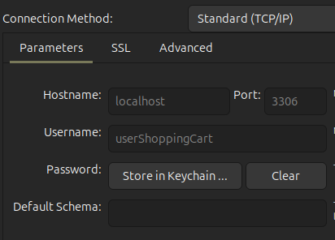
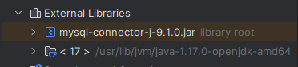
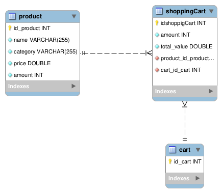
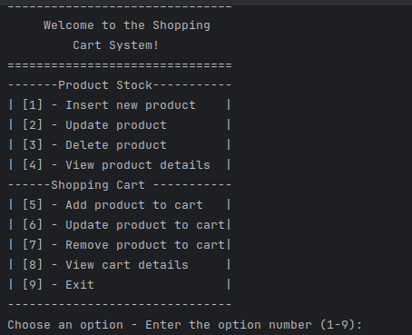

# ShoppingCart

Desafio 1 da Compass UOL: Um sistema desenvolvido em Java para gerenciar um carrinho de compras com integração ao Banco de dados (JDBC).

---
## Requisitos necessários
- Java e MySQL instalados corretamente na máquina.
- Versão recomendada do Java:
    - Java 17.
- Recomendado.: Utilizar MySQL Workbench para interface visual e gerenciamento do BD.
    - Versão: MySQL Workbench 8.0.36 Community.
- Conector MySQL:
    - Versão: MySQL Connector/J (.jar file, versão 9.1).
---
## Etapas de Configuração
### Configurar o Usuário e Permissões no MySQL

1. É preciso configurar o acesso ao banco de dados com um usuário e senha, tendo as seguintes credenciais:
    - **Usuário**: userShoppingCart
    - **Senha**: Shcart@2025
    - **Porta**: 3306
    - **Hostname**: localhost

Importante: o usuário deve ter permissões necessárias para fazer modificações.

A configuração também pode ser feita através dos comandos no MySQL para criação do usuário:

   ```sql
   CREATE USER 'userShoppingCart'@'localhost' IDENTIFIED BY 'Shcart@2025';
   GRANT ALL PRIVILEGES ON *.* TO 'userShoppingCart'@'localhost';
   FLUSH PRIVILEGES;
  ```

2. Caso tenha o MySql workbench na máquina, crie uma nova conexão, e deve informar os dados criados anteriormente. E após isso, só verificar e testar a conexão. Segue um exemplo:



3. Tendo feito a conexão corretamente. Dentro desta conexão realizada, crie um banco de dados MySQL chamado `shoppingcartjdbc`.
   ```sql
   CREATE DATABASE shoppingcartjdbc
   ```
4. Execute o script do arquivo `database_shoppingCart.sql` no BD para criar as tabelas.
5. Se foi criado corretamente o usuário e senha no MySQL conforme os passos acima, o arquivo [`db.properties`](./db.properties) não precisa ser alterado, mas caso esteja utilizando outro usuário, é preciso editar o aquivo com as credencias do seu banco de dados: (usuário e senha) e a URL correspondente ao BD. Recomendado criar o mesmo usuário e senha da etapa 1, para não ser preciso mexer no arquivo de db.


### Dependências
1. Como a conexão é feita por JDBC, é preciso adicionar o arquivo `.jar` do MySQL Connector como uma biblioteca externa no projeto.
    - Para IntelliJ IDEA: Vá em `File > Project Structure > Modules > Dependencies` e clique na opção "+" e adicione o arquivo `.jar`.
    - Caso não tenha o arquivo `.jar` na máquina, pode fazer o download pelo site: https://downloads.mysql.com/archives/c-j/
    - Caso seja outra IDE, necessário colocar o arquivo `.jar` nas dependências (bibliotecas) externas.
    - O arquivo `.jar` estará localizada da seguinte forma:
      
---
## Executar o projeto
1. Tenha todos os requisitos necessários instalados.
2. Fazer o clone do repositório.
2. Verificar se o MySQL está em execução.
2. Compilar e executar o projeto na IDE (Recomendado: Intellij IDEA).
3. Localizar o arquivo `Main.java` na pasta `src` e rodar este arquivo.


## Funcionalidades
- As tabelas do BD estão organizadas da seguinte forma, a seguir é apresentado o DER do projeto:



- O projeto utiliza o padrão de projeto MVC (Model, view e Controller), utilizando a conexão ao banco de dados com o JDBC.
    - O model é reponsável por criar as entidades, dao.
    - O view pela interação com usuário através de entrada e saída para o usuário.
    - O Controller por intermediar as camadas view e model.
- Após rodar o projeto, caso tenha funcionado corretamente, apresentará no console:
  
- É bem intuitivo, apenas colocar a opção desejada.
- É possível gerenciar estoques de produtos, e também no gerenciamento do carrinho de compras.